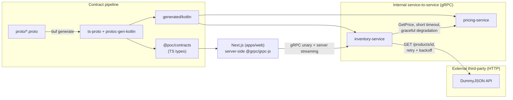

# grpc-kotlin-nextjs-poc

> **Status: scaffold only, implementation pending.** This repo currently
> contains folder structure, config files, and placeholder/stub files with
> `TODO` comments. No RPC handlers, UI components, external API calls,
> tests, or generated code exist yet — see the `TODO` comment in each stub
> file for what belongs there.

A portfolio PoC demonstrating end-to-end communication across:

- a Kotlin gRPC backend split into two services, with **internal
  service-to-service** calls between them,
- an **external third-party async integration** (the public
  [DummyJSON](https://dummyjson.com/products) API), and
- a **Next.js frontend** that consumes the same `.proto`-generated types as
  the backend, via a versioned workspace package.

## Architecture



Two distinct integration branches originate from `inventory-service`:
an **internal** gRPC call to `pricing-service` (same trust domain, low
latency, degrades gracefully), and an **external** HTTP call to DummyJSON
(different trust domain, higher latency variance, retried with backoff and
mapped to a domain-level result).

## Why gRPC here

- **Shared contract as source of truth.** `.proto` files define request/
  response shapes once; both the Kotlin services and the TypeScript
  frontend generate their types from the same definitions instead of
  hand-syncing REST DTOs.
- **Streaming built in.** `WatchStock` needs server-to-client streaming;
  gRPC supports this natively without bolting on SSE/WebSocket plumbing at
  the application layer (Next.js still bridges it to the browser at the
  edge, since browsers can't speak gRPC directly).
- **Strong typing across the service boundary**, including for the
  internal `inventory-service -> pricing-service` call, where a REST+JSON
  contract would otherwise need separate client/server validation.

## Contract versioning

- `buf breaking` (wired as a CI step, see `.github/workflows/ci.yml`) runs
  against `proto/` on every change and fails the build if a change would
  break existing consumers (removed fields, changed types, renumbered
  fields, etc.).
- `packages/contracts` is versioned independently (semver) from the
  services that implement the contract. A backward-compatible proto change
  is a minor/patch bump; a breaking change (caught by `buf breaking`, or
  intentionally allowed with a major version bump) requires consumers
  (`apps/web`) to explicitly upgrade.
- Generated code is never committed — it's regenerated from `proto/` via
  `pnpm generate`, keeping the proto files as the single source of truth
  rather than the generated output.

## Service-to-service architecture

`pricing-service` is deliberately a separate deployable service from
`inventory-service` rather than a module folded into it, to demonstrate a
realistic distributed-systems boundary:

- **Blast radius isolation.** A bug, deploy, or resource exhaustion in
  pricing logic can't take down inventory reads/writes — the two fail
  independently.
- **Independent scaling and deployment.** Pricing rules and inventory CRUD
  have different load shapes and change cadences in a real system; splitting
  them lets each scale and ship on its own schedule.
- **Availability vs. consistency tradeoff.** `GetItemWithPricing` treats
  pricing data as *supplementary*, not authoritative: if `pricing-service`
  is slow or down, `PricingServiceClient` times out quickly (a short,
  internal-call timeout) and `inventory-service` still returns the item
  without pricing rather than failing the whole request. This is a
  conscious choice to favor **availability** of the core inventory read
  path over **consistency/completeness** of the pricing data attached to
  it — acceptable because a missing price is a degraded UI state, not a
  correctness violation, for this PoC's domain.

## Async third-party integration

`DummyProductClient` calls the public DummyJSON API to enrich inventory
items with supplementary product data (`EnrichItem`). Because it's a
third-party dependency outside our trust and reliability domain, it's
handled differently from the internal pricing call:

| | Internal (`PricingServiceClient`) | External (`DummyProductClient`) |
|---|---|---|
| Timeout | short (fail fast) | longer (external APIs are slower/less predictable) |
| Retry | none — fail fast and degrade | exponential backoff, max 3 attempts, on 5xx/timeout only |
| Errors | caught, item returned without pricing | mapped to a sealed result (success / not-found / unavailable) instead of leaking exceptions |
| Failure mode | graceful degradation (partial response) | `EnrichItem` surfaces the domain result explicitly to the caller |

The retry-with-backoff + sealed-result approach keeps transient DummyJSON
failures from becoming gRPC-layer exceptions, while still distinguishing a
genuinely missing product (404, no retry) from a temporarily unavailable
upstream (5xx/timeout, retried).

## Testing strategy

Only `DummyProductClientTest` exists in this skeleton, using Ktor's
`MockEngine` to simulate DummyJSON responses (200/404/500) without real
network calls. This is the one piece of logic in the PoC worth testing in
isolation: it has actual branching behavior (retry policy, error mapping)
that's easy to get subtly wrong and doesn't require a running server to
verify. CRUD operations and the pricing client are intentionally left
untested — they're straightforward pass-through logic that wouldn't
demonstrate anything a reviewer can't already see by reading the code, and
adding tests for them would be testing the framework, not the PoC's ideas.

## Repo layout

```
grpc-kotlin-nextjs-poc/
├── proto/                    # .proto contracts (source of truth)
├── packages/contracts/       # generated TS types, versioned workspace package
├── apps/
│   ├── inventory-service/    # Kotlin gRPC service (CRUD, streaming, external + internal calls)
│   ├── pricing-service/      # Kotlin gRPC service (pricing lookups)
│   └── web/                  # Next.js App Router frontend
├── generated/kotlin/         # buf-generated Kotlin stubs (gitignored)
├── buf.yaml / buf.gen.yaml   # codegen + breaking-change config
└── docker-compose.yml        # local multi-service run
```

## Setup (once implementation lands)

```bash
pnpm install
pnpm generate        # buf generate -> packages/contracts + generated/kotlin
pnpm dev             # apps/web
./gradlew build      # both Kotlin services (requires a Gradle wrapper + JDK 17+, not yet added)
docker compose up    # all three services together
```
